This repository contains the source code of the data management software suite developed for the Horizon 2020 EU project [SIMUTOOL](https://cordis.europa.eu/project/rcn/198371)  between the years of 2015 and 2019. It was developed at the [University of Bamberg](https://www.uni-bamberg.de) in the [MOBI](https://www.uni-bamberg.de/en/mobi/) chair.

**Components**:

* Data Lake Server ([simutool/kgservice](https://github.com/simutool/kgservice), [simutool/model-builder ](https://github.com/simutool/model-builder), [simutool/dm-reader](https://github.com/simutool/dm-reader), and others): Manage data lake entries, in specific metadata, storage, and discovery of data lake contents. It builds a semnatic data model layer on top of a property graph store. 
* Data Visualization Client ([simutool/om-tool](https://github.com/simutool/om-tool)): An application for visualizing manufacturing sensor data and comparing it with reference data, as we well as uploading data assets and thier metadata to the KGService.
* Native OS Client ([simutool/aku-client](https://github.com/simutool/aku-client)): End-user application to assist users to add and upload data assets and thier metadata to the Data Lake Server.
