# SIMUTOOL System Design

This document delves into the **system design** of the SIMUTOOL inter-organizational data sharing system. For a project overview, see [github.com/simutool](https://github.com/simutool).

## Architecture

Based on the analysis of the domain, we successfully conceptualized and constructed a comprehensive ecosystem of tools, centralized around a dynamic data lake, aimed at optimizing the seamless sharing and exchange of data assets among heterogenous systems/interfaces, participants, and groups.

The figure below showcases the deployed SaaS architecture utilized throughout the system's operational lifespan. From its inception, the system was designed with future scalability in mind, poised to accommodate increased traffic volumes and the need for enhanced performance and availability. For a detailed exploration of potential scaling scenarios for this system, refer to the section [Scaling the Architecture](https://github.com/simutool#scaling-the-architecture) below.

### Future-Proof Design Principles

- **API-First Distributed System Design**: HTTP API interfaces took precedence in the project's design, anchored by meticulously crafted domain models.
  
- **Stateless Nodes**: Application servers, such as platform layers, were engineered to be stateless, enabling horizontal scalability effortlessly.

- **Isolated Storage Nodes**: Storage components were strategically isolated into independent nodes, laying the groundwork for both horizontal and vertical database scaling architectures, ensuring scalability.

### Key Components of the System

- **Data Lake Server ([simutool/kgservice](https://github.com/simutool/kgservice), [simutool/model-builder](https://github.com/simutool/model-builder), [simutool/dm-reader](https://github.com/simutool/dm-reader), and others)**: This component manages data lake entries, including metadata, storage, and data discovery. It establishes a semantic data model layer atop a property graph store.

- **Data Visualization Client ([simutool/om-tool](https://github.com/simutool/om-tool))**: An application designed for visualizing manufacturing sensor data, facilitating comparisons with reference data, and uploading data assets and their metadata to the KGService.

- **Native OS Client ([simutool/aku-client](https://github.com/simutool/aku-client))**: This end-user application aids users in adding and uploading data assets and their metadata to the Data Lake Server.

## Scaling the Architecture

System scalability hinges on several factors: usage patterns, desired performance and availability, and available project resources. The architecture depicted in the following figure is tailored to meet the specific requirements of our domain. 

### Design Rationale

1. **Read-Heavy Workload**: The system primarily experiences a read-heavy workload, particularly in the **Catalog DB**, which houses metadata of data lake contents, and to a lesser extent in the **Blob Store Server**, storing heterogeneous file types in their original formats. However, two key distinctions are noted:
   - The **Catalog DB** witnesses a high rate of read traffic, albeit with small and constant data sizes per read operation.
   - Conversely, the **Blob Store Server** encounters frequent traffic spikes, handling large and diverse data sizes.

2. **Data Lake Server Load and Single Point of Failure**: Although no performance issues were encountered initially, it became evident that the first scalability measure should target the Data Lake Server.

Considering the above analysis, several dimensions of scaling are identified:

1. **Horizontal Scaling of Data Lake Server**: Leveraging the stateless architecture of the Data Lake Server, horizontal scaling can be seamlessly achieved without significant modifications. Utilizing Docker multi-container environments facilitates the deployment of new instances, supplemented by one or more load balancers to manage traffic distribution.

2. **Supporting Blob Store with CDN**: Given the spikes in data download following new data additions, horizontally partitioning (sharding) the Blob Store isn't optimal, as spikes typically involve the same data, potentially overloading specific shards. Implementing a CDN between the Blob Store and clients emerges as a superior solution to enhance data delivery efficiency.

3. **Implementing Master-Slave Architecture for Catalog DB**: Acknowledging the read-heavy nature of the Catalog DB, a master-slave replication model (write to master; read from the slave) is proposed as a straightforward and effective solution. Initial deployment could include two slave nodes, with the flexibility to scale further based on demand.

