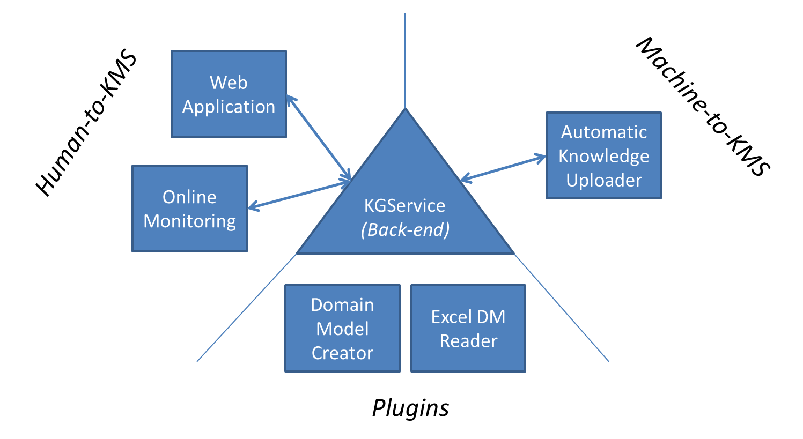

This is the entry repository to the SIMUTOOL Knowledge Management Suite (KMS) of software published under the [simutool github organization](https://github.com/simutool). This project was developed for the Horizon 2020 EU project [SIMUTOOL (2015-2019)](https://cordis.europa.eu/project/rcn/198371). It was developed at the [University of Bamberg](https://www.uni-bamberg.de) in the [MOBI](https://www.uni-bamberg.de/en/mobi/) chair.

## The Architecture

* KGService: Knowledge Graph that acts as a data catalog on top of a file system to store heterogenous data assets ([https://github.com/simutool/kgservice](https://github.com/simutool/kgservice))
* 

