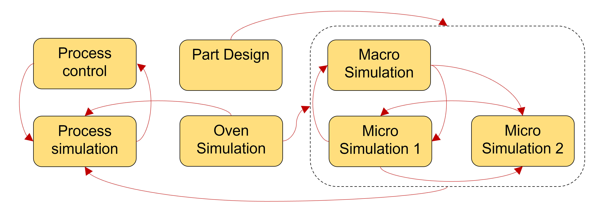
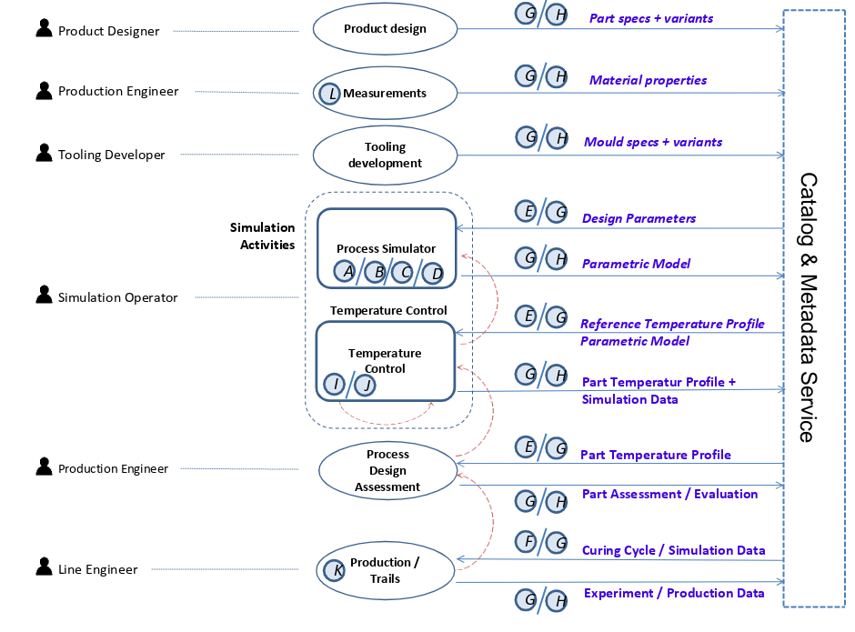

# SIMUTOOL — Inter-Organizational Data Sharing for Collaborative Manufacturing R&D

A deployed data-cataloging and sharing platform built for an EU Horizon 2020 project on microwave processing of composites in the aerospace and automotive sectors ([SIMUTOOL](https://doi.org/10.3030/680569), 2015–2019). It let eight companies with incompatible systems, proprietary simulation tools, and differing confidentiality and legal constraints describe, discover, and exchange data assets across organizational boundaries — without integrating their underlying systems.

This is the inter-organizational data-sharing problem now addressed by initiatives like Catena-X and the EU Data Act, tackled here hands-on, in the field, years before those existed.

> **System-design deep-dive:** see [ARCHITECTURE.md](./ARCHITECTURE.md).

> **Research context:** [dissertation](https://fis.uni-bamberg.de/handle/uniba/91269) · 
> [CORDIS](https://cordis.europa.eu/project/id/680569) ·
> [project page, Uni Bamberg](https://www.uni-bamberg.de/en/mobi/research/simutool/)

## The setting

Eight geographically dispersed partners, each with distinct specializations and proprietary systems, many of whom had never worked together. The hard part was never the variety of data formats — it was the dense web of data-driven dependencies between activities, especially the simulations: process control depended on process simulation of the part (and vice versa), and was further shaped by oven simulations predicting microwave behavior. Coordinating these hand-offs, across confidentiality boundaries, was the core challenge.

## What was built

A platform centered on describing and exchanging data assets rather than moving or integrating systems:

- **Catalog & metadata service** — a semantic metadata layer (controlled vocabularies over a property-graph store) managing descriptions, discovery, and access for heterogeneous assets.
- **Blob store** — heterogeneous files kept in their original formats.
- **End-user clients** — an upload client for adding assets and metadata, and a client for
  visualizing and comparing manufacturing sensor data.

The system was deployed and used across the consortium for the duration of the project. The repositories in this organization are an **archived snapshot of the project's prototype implementation**, preserved for reference.

## Team & role

The software-solutions team at the University of Bamberg (Chair of Mobile Systems, Prof. Daniela Nicklas). I was the project's architect and lead developer and the one constant member across its full duration — owning the architecture, building hands-on, and coordinating the data-sharing design across partners.

- **Project lead / architect / developer:** Nasr Kasrin
- **Research associates:** Maliha Qureshi, Simon Steuer
- **Developers:** Adrian Lengenfelder, Valentina Veloso, Lukas Genssler, Katharina Broswik, Harshit Gupta
- **Supervisor:** Prof. Daniela Nicklas

## External systems (selected)

Circular identifiers in the diagram denote the external-facing systems of participating companies. A fuller list is in the dissertation (p. 66).

| ID | Systems                          | Owner | License     | Platform       | Description                                                                                               |
|----|----------------------------------|-------|-------------|----------------|-----------------------------------------------------------------------------------------------------------|
| A  | PGD EM Solver                    |  [École centrale de Nantes](https://www.ec-nantes.fr) | n/a         | MATLAB         | Employs a 3D Maxwell solver for microscopic analysis of stratified media.                                  |
| B  | PGD Parameterization Tool        |  [École centrale de Nantes](https://www.ec-nantes.fr) | n/a         | MATLAB         | Facilitates the construction of parametric models based on simulation data.                                |
| C  | ESI CEM One                      | [ESI Group](https://esi-group.com/) | Proprietary | Windows/Linux  | Offers a computational electromagnetic solution for virtual testing of large-scale industrial applications.|
| D  | ESI PAM-COMPOSITES               | [ESI Group](https://esi-group.com/) | Proprietary | Windows/Linux  | Provides a simulator suite for modeling the manufacturing process of composite structural components.     |
| E  | Data Catalog						|[Bamberg University](https://www.uni-bamberg.de/en/)  | Apache 2.0  | Backend / API Service |  Manages creating, discovering, and managing inter-organizational data assets. |
| F  | Online Monitoring Tool			|[Bamberg University](https://www.uni-bamberg.de/en/)  | Apache 2.0  | Dashboard / Web App |   Visualizes sensor data, and assists users in metadata entry / data asset creation. |
| G  | KMS Web Interface				|[Bamberg University](https://www.uni-bamberg.de/en/)  | Apache 2.0  | Web Application |  Allows users to access the data catalog in a GUI. |
| H  | Automatic Knowledge Uploader		|[Bamberg University](https://www.uni-bamberg.de/en/)  | Apache 2.0  | Local OS Deamon |  Facilitates the users' generation and entry of the metadata of data assets. |
| I | Process Control Simulation GUI	| ETS   | Proprietary | Windows      | Solution supporting automatic and user-guided temperature and power control simulation. |
| J |  Temperature Variation Controler | ETS   | Proprietary | Windows      | LabVIEW Module providing the optimum allocation (distribution) of the MW oven power during manufacturing process. |
| K | Temperature Virtual Sensor GUI  | ETS   | Proprietary | Windows      | Windows GUI for controlling the Virtual Sensor hardware. |
| L | Microwave dielectric measurement  | ETS   | Proprietary | Windows      |Windows For controlling the microwave dielectric measurement system. |
