# SIMUTOOL Data Lake SaaS (Architecture / Source Code)

This repository contains the source code for a data lake / data management SaaS platform developed for an EU Horizon 2020 manufacturing project between the years of 2015 and 2019. 

The project involved a consortium of 8 organizations working cooperatively to further the know-how of microwave-assisted manufacturing (as opposed to classical manufacturing in heat ovens). The work was characterized by data-driven and close collaboration with requirements of quick turnaround time. 

We developed a software suite as a model for supporting the close collaboration and data sharing in industrial manufacturing projects. In this repository (and github organization) we present the technical architecture as well as point to the source code of some of the components of the project. 

A more general (not software-related) description of the project can be found [here](https://www.uni-bamberg.de/en/mobi/research/simutool/).

## Architecture

The figure above presents the deployed SaaS architecture during the lifetime the system was used by the end users. The system was designed to be scalable, however we did not need to scale it further than that during its lifetime. However, key nodes have been designed as *stateless/scalable* that can be scaled when needed. The section [Scaling the Architecture](Scaling_the_Architecture) present one possible scenario to scale the system design. Below we briefly discuss some of the elements of the system.

**Components**:

* Data Lake Server ([simutool/kgservice](https://github.com/simutool/kgservice), [simutool/model-builder ](https://github.com/simutool/model-builder), [simutool/dm-reader](https://github.com/simutool/dm-reader), and others): Manage data lake entries, in specific metadata, storage, and discovery of data lake contents. It builds a semantic data model layer on top of a property graph store. 
* Data Visualization Client ([simutool/om-tool](https://github.com/simutool/om-tool)): An application for visualizing manufacturing sensor data and comparing it with reference data, as we well as uploading data assets and their metadata to the KGService.
* Native OS Client ([simutool/aku-client](https://github.com/simutool/aku-client)): End-user application to assist users to add and upload data assets and their metadata to the Data Lake Server.

## Scaling the Architecture

